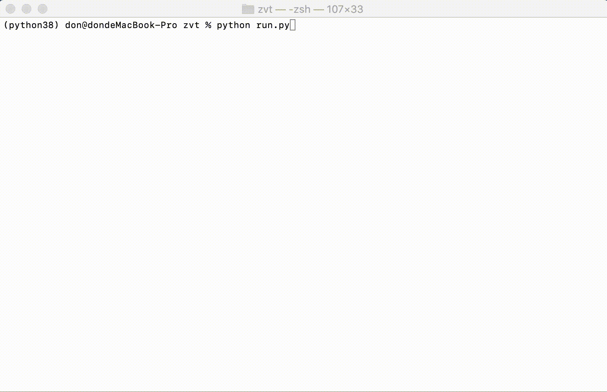

**Read this in other languages: [English](README-en.md).**  

ZVT 源項目地址：https://github.com/zvtvz/zvt

本项目改进点包括：
* 增加postgresql数据库支持，允许远程数据访问，实现微服务器数据爬虫与GPU模型训练工作站逻辑分离。
* 统一http访问入口，增加Session与请求重试逻辑（后续可通过RxPy实现响应式编程的异步模式）。
* 增加多进程数据请求逻辑，允许数据并发请求，加快数据获取。
* 增加数据爬取进度展示。
* log信息从控制台输出改为写文件记录。
* 一些逻辑漏洞修复。

为更好管控控制台信息输出，需要对jqdatasdk项目进行部分修改，详见：https://github.com/doncat99/jqdatasdk

界面如图：

